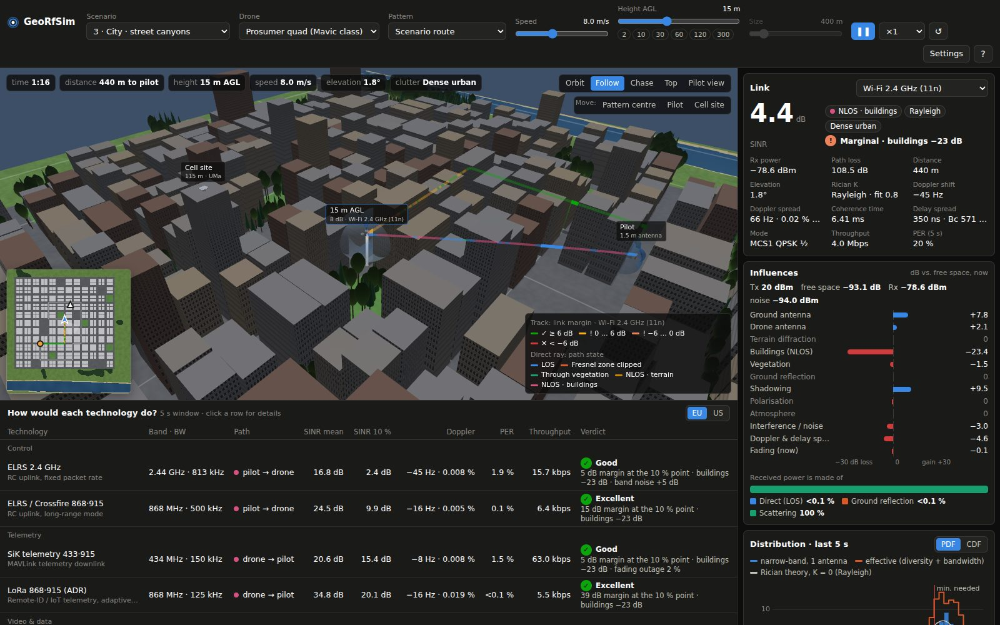
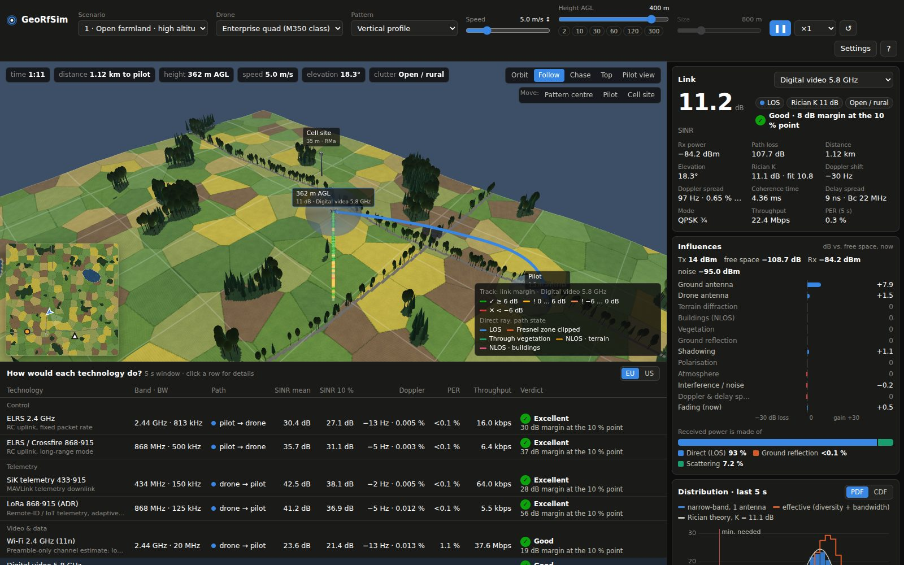

# GeoRfSim

A 3-D viewer that flies a drone over a landscape and shows, live, what happens
to its radio links. You pick the terrain, the airframe, the flight pattern, the
speed and the height. GeoRfSim draws the flight track coloured by link quality
and breaks the received signal down into what helps and what hurts: line of
sight, terrain, buildings, vegetation, ground reflection, scattering,
shadowing, antennas, interference and Doppler. It also judges ten radio
technologies, from LoRa to 5G mmWave, on the same flight.

It does **not** trace rays. Geometry only decides *whether* the direct path is
clear, clipped, through foliage or blocked. Established models then decide
*how much* each mechanism costs. A Rician/Rayleigh fading process turns the
result into the signal distribution of the last 5 seconds.





## Starting it

```bash
docker compose up --build        # then open http://localhost:8080
```

The container is bound to `127.0.0.1` only. Put a reverse proxy with TLS in
front of it to expose it. Any static server works for development, because
there is no build step and no dependency:

```bash
python3 -m http.server 8000 --directory app
```

Tests (Node ≥ 20, no packages to install):

```bash
npm test                          # = node --test tests/*.test.js
```

## Using it

Everything applies immediately. There are no "apply" buttons.

| What | How |
| --- | --- |
| Scenario, drone, pattern | selects in the top bar (or keys `1`…`6` for scenarios) |
| Speed, height, pattern size | sliders. Height is a log slider (1 m – 1 km) with presets 2 / 10 / 30 / 60 / 120 / 300 m |
| Play, pause, time warp | `Space`, `,` / `.` (×0.25 … ×20), `R` restarts and clears the track |
| Camera | drag: orbit · right-drag or Shift: pan · wheel: zoom · double-click: look there |
| Camera modes | Orbit, Follow, Chase, Top, Pilot view (`C` cycles, `F` `T` `P`) |
| Move things | "Move: Pattern centre / Pilot / Cell site", then click the 3-D view or the minimap |
| Technology in detail | click a row in the table, or `↑` / `↓` |
| Antennas | ground and drone antenna selects in the *Antennas* card. *Auto* uses each technology's typical antenna |
| Settings (`S`) | height scale (log / linear / true), h₀, exaggeration, terrain relief, tree size, layers, track colouring, pilot antenna height, interference, cell load, shadowing, fading, obstacle avoidance |
| Region | EU / US switch above the table (frequencies and Tx powers) |

The URL carries the scenario, drone, pattern, speed, height, size, centre,
technology and antennas, so a link reproduces the setup. Display settings are
remembered in `localStorage`.

### What you see

* **3-D view.** The flown track is coloured by link margin, by path state
  (LOS, Fresnel zone clipped, vegetation, NLOS terrain, NLOS buildings) or by
  height. Drop lines and a ground shadow show the 3-D position. The direct ray
  to the ground node is drawn as a curve coloured by what it passes through.
  The ground-reflection path appears when it matters. Translucent lobes show
  both antenna patterns, oriented with the airframe's attitude. Hidden parts
  (a drone under the canopy, a track behind buildings) stay visible as an
  x-ray.
* **Link card.** SINR, Rx power, path loss, distance, elevation, Rician K
  (model and fitted), Doppler shift and spread, coherence time, delay spread
  and coherence bandwidth, current mode/MCS, throughput and PER.
* **Influences.** Each mechanism's contribution in dB relative to free space,
  plus how the received power splits into direct, ground-reflected and
  scattered parts.
* **Distribution · last 5 s.** A histogram (or CDF on a log-probability axis)
  of the narrow-band single-antenna SINR, overlaid with the Rician theory for
  the current K. The *effective* SINR after antenna diversity and
  wideband/frequency diversity is shown next to it. 1 % and 10 % points are
  marked, together with the fade depth and the diversity gain.
* **SINR · last 30 s.** Instantaneous vs. large-scale SINR against the most
  robust mode's threshold.
* **Antennas.** The elevation cut of both antennas in the plane of the link,
  with the current direction marked.
* **Reference models.** Free space, this simulation, 3GPP TR 36.777 /
  TR 38.901 (LOS/NLOS and P(LOS)) and Al-Hourani et al. for the same geometry.
* **Technology table.** Per technology: band and bandwidth, path (with its
  state), mean and 10 % SINR, Doppler shift and spread relative to the
  subcarrier spacing, PER, throughput (DL/UL for cellular), and a verdict
  (*Excellent … No link*) with its reasons.

## Height scale

Heights above ground are drawn logarithmically: `y = H · log10(1 + h / h₀)`.
A pilot at 1.5 m, a 20 m canopy, a street canyon and a drone at 400 m all stay
readable on a map several kilometres wide. Terrain relief is linear (with an
adjustable exaggeration). The mapping is monotonic for every ground point, so
"above / below the canopy" is always drawn correctly. That is also why the
straight direct ray appears as a curve. Tree crowns are widened with the
vertical scale and forest instances are thinned accordingly, so trees appear
larger than life instead of as needles. Settings switches to linear or true
scale.

## Scenarios

| # | Scenario | Shows |
| --- | --- | --- |
| 1 | Open farmland · high altitude | Fields, small woods, hedgerows, a lake. Vertical profile to 400 m: the two-ray ground reflection and scattering lose influence with height, K rises |
| 2 | Forest · through the woods | Mixed forest with a forest road. Under-canopy flight at 6 m vs. above-canopy. Vegetation loss and Rayleigh fading |
| 3 | City · street canyons | Blocks, towers, a park, a river. A street route switches between LOS and NLOS at every corner. Rooftop cell site |
| 4 | Suburb · houses & gardens | Low-rise houses with garden and street trees. Scattering everywhere, clear LOS from ~30 m |
| 5 | Hills & valley · terrain shadowing | A forested ridge between pilot and village. Knife-edge diffraction behind the crest |
| 6 | Lake · over-water reflection | Calm water is a near-perfect mirror. Two-ray interference dominates at low height |

Every world is procedurally generated from a fixed seed: terrain, land use,
building blocks, trees and routes. Generation takes about 0.1 s.

## Drones and patterns

| Drone | Type | Cruise / max | Notes |
| --- | --- | --- | --- |
| Mini quad (<250 g) | multirotor | 8 / 16 m/s | 30° max tilt |
| Prosumer quad (Mavic class) | multirotor | 12 / 21 m/s | |
| Enterprise quad (M350 class) | multirotor | 10 / 23 m/s | |
| FPV racer (5-inch) | multirotor | 22 / 40 m/s | 60° tilt: strong attitude effects |
| Heavy-lift hexa (agri) | multirotor | 6 / 10 m/s | |
| Fixed-wing mapper | fixed wing | 16 / 25 m/s | min 11 m/s, banks in turns, cannot hover |
| VTOL long-range | VTOL | 22 / 30 m/s | |

Patterns: hover, out & back (range test from the pilot), orbit, figure 8,
survey (lawnmower), vertical profile, spiral climb, and a scenario route
(streets, forest road, ridge crossing, lake loop). Turn radii follow the
airframe (`tan φ = v²/(g·R)`). Multirotors pitch with speed and bank in turns,
and that attitude rotates the antennas. Obstacle avoidance lifts the path over
roofs and tree crowns at the airframe's climb rate but allows under-canopy
flight below the crown base. Height changes are flown at the climb rate, not
teleported.

## Technologies

| Technology | Ground node | Band · BW | Tx EU / US | PHY abstraction |
| --- | --- | --- | --- | --- |
| ELRS 2.4 GHz | pilot → drone | 2.44 GHz · 812.5 kHz | 20 / 24 dBm | LoRa SF6, 250 Hz packets |
| ELRS / Crossfire 868·915 | pilot → drone | 868 / 915 MHz · 500 kHz | 14 / 27 dBm | LoRa SF7, 100 Hz |
| SiK telemetry 433·915 | drone → pilot | 433 / 915 MHz · 150 kHz | 10 / 20 dBm | GFSK 64 kbit/s |
| LoRa 868·915 (ADR) | drone → pilot | 868 / 915 MHz · 125 kHz | 14 / 20 dBm | SF7…SF12, adaptive |
| Wi-Fi 2.4 GHz (11n) | drone → pilot | 2.437 GHz · 20 MHz | 20 / 27 dBm | MCS0…7, preamble-only channel estimate |
| Digital video 5.8 GHz | drone → pilot | 5.8 GHz · 20 MHz | 14 / 28 dBm | OFDM with pilots (OcuSync-like, numerology assumed) |
| Analog FPV 5.8 GHz | drone → pilot | 5.8 GHz · 18 MHz | 14 / 23 dBm | FM threshold 10 dB |
| LTE 800 (B20) | cell ⇄ drone | 806 MHz · 10 MHz | 46 dBm BS / 23 dBm UE | CQI 1…15 |
| 5G NR 3.5 GHz (n78) | cell ⇄ drone | 3.6 GHz · 40 MHz | 46 / 26 dBm | 256QAM CQI, massive-MIMO beams with limited vertical scan |
| 5G NR 26 GHz (n258) | cell ⇄ drone | 26 GHz · 200 MHz | 33 / 23 dBm | 120 kHz SCS, beam-steered arrays |

Transmit powers and receiver figures are assumptions for comparison, not
certifications. They are listed in `app/js/rf/tech.js`.

## Models

Per technology and sub-step (≤ 50 ms of flight time):

```
P_mean = P_tx + G_ground + G_air − FSPL − L_terrain − L_buildings − L_vegetation − L_gas − L_pol + shadowing
r(t)   = √(P_mean·K/(K+1)) · (1 + Γ·e^{−jkΔ(t)}) · e^{jφ_LOS(t)} + √(P_mean/(K+1)) · g(t)
```

| Mechanism | Model |
| --- | --- |
| Free space | Friis |
| Line of sight | Geometric: the ray is checked against terrain, building and canopy rasters (~3–8 m) |
| Terrain | Single knife-edge J(ν), ITU-R P.526, at the dominant obstacle (a clipped Fresnel zone counts too) |
| Buildings | Rooftop knife-edge, capped by the 3GPP TR 36.777 / TR 38.901 NLOS excess loss, which stands in for street-canyon multipath |
| Vegetation | Weissberger's modified exponential decay over the foliage depth, saturating at the ITU-R P.833 maximum attenuation |
| Ground reflection | Two-ray model with Fresnel coefficients (ITU-R P.527 ground constants) and Ament roughness. Circular polarisation cancels it at steep angles |
| Scattering / fading | Rician with K(θ) = K₀·exp(2θ/π·ln(K₉₀/K₀)) per clutter class (Azari et al.), ranges after the NASA/Matolak air-ground campaigns. Obstructions remove the coherent part (→ Rayleigh). Sum-of-sinusoids generator with a Clarke/Jakes Doppler spectrum (Zheng & Xiao) |
| Shadowing | Log-normal. σ follows 3GPP TR 36.777 (height dependent in LOS). Gudmundson correlation over the flown distance |
| Antennas | 3GPP TR 38.901 parabolic patterns, half-wave dipole, steerable arrays. Polarisation mismatch from the airframe attitude. Diversity = selection combining |
| Wideband | MIESM over ~bandwidth / coherence-bandwidth independent sub-bands |
| Mobility & multipath | Doppler ICI ((π²/3)(f_D/Δf)²), channel aging (Jakes J0 correlation over the estimate interval) and energy beyond the cyclic prefix, as SINR ceilings |
| Cellular interference | 18 virtual hexagonal neighbour sites (3 sectors each) with 3GPP LOS-probability-weighted path loss and load. This is why drones high up see poor SINR |
| Unlicensed bands | Assumed noise rise in 2.4 / 5.8 GHz and sub-GHz ISM bands, growing with receiver height in built-up areas |
| PER & throughput | Mode/MCS tables (LTE/NR CQI, 802.11n, LoRa SF), link adaptation and a logistic PER waterfall (10 % at each threshold) |

References: ITU-R P.526-15, P.527-6, P.676-13, P.833-10; Weissberger (1982);
Ament (1953); 3GPP TR 36.777 V15.0.0, TR 38.901 V17, TS 36.213, TS 38.214;
Al-Hourani, Kandeepan & Lardner, *Optimal LAP altitude for maximum coverage*
(IEEE WCL 2014); Azari, Rosas, Chen & Pollin, *Ultra reliable UAV communication
using altitude and cooperation diversity* (IEEE TCOM 2018); Matolak & Sun,
*Air–ground channel characterization for unmanned aircraft systems* I–III
(IEEE TVT 2017); Gudmundson (1991); Zheng & Xiao (2003); Russell & Stüber
(1995).

**What it is not.** GeoRfSim is a teaching and comparison tool. Its worlds are
synthetic, and its parameters are typical values rather than measurements of a
particular site or radio. Use it to understand trends and orders of magnitude,
not for link planning or certification.

## Layout

```
app/
  index.html, css/style.css, favicon.svg
  js/
    main.js        UI controller: state, controls, render loop, panels, table
    sim.js         simulation engine: geometry, per-technology link, fading samples, 5 s stats, track
    flight.js      drone profiles, patterns, obstacle-safe height profile, attitude
    world.js       procedural world: terrain, land use, buildings, trees, LOS profile queries
    scenarios.js   the six scenarios
    charts.js      2-D charts: distribution, history, antenna polar, minimap
    util.js        seeded RNG, noise, Bessel functions, formatting
    rf/            models.js, antennas.js, fading.js, tech.js, interference.js
    gfx/           renderer.js (WebGL2), camera.js, meshes.js, gl.js, mat.js
tests/             node:test unit tests (models, antennas, fading, worlds, simulation)
Dockerfile, nginx.conf, docker-compose.yml
```

The renderer is plain WebGL2. Heights are mapped to the log scale in the
vertex shaders, so changing the scale is a uniform update. Trees and buildings
are instanced, track and rays are instanced screen-space lines, and the track
uploads incrementally. While paused the view only redraws when something
changes.

## Hosting securely

The app has **no runtime dependencies**: no framework, no
npm or pip package at runtime, no CDN, no fonts from elsewhere, no tracking, no
cookies and no backend. That is what allows a strict Content-Security-Policy
without `unsafe-inline` or `unsafe-eval`.

| Measure | Where |
| --- | --- |
| rootless nginx (uid 101), current base image | `Dockerfile` |
| read-only file system, all capabilities dropped, `no-new-privileges` | `docker-compose.yml` |
| bound to `127.0.0.1`, memory and process limits | `docker-compose.yml` |
| GET and HEAD only, everything else 405 | `nginx.conf` |
| strict CSP (`default-src 'none'`), `nosniff`, `X-Frame-Options: DENY`, `Referrer-Policy`, `Permissions-Policy`, COOP/CORP | `nginx.conf` |

Rebuild regularly (`docker compose build --pull`) so nginx and Alpine patches
arrive.
